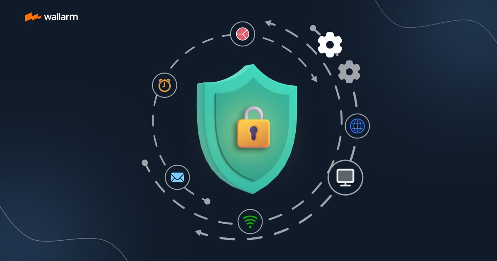
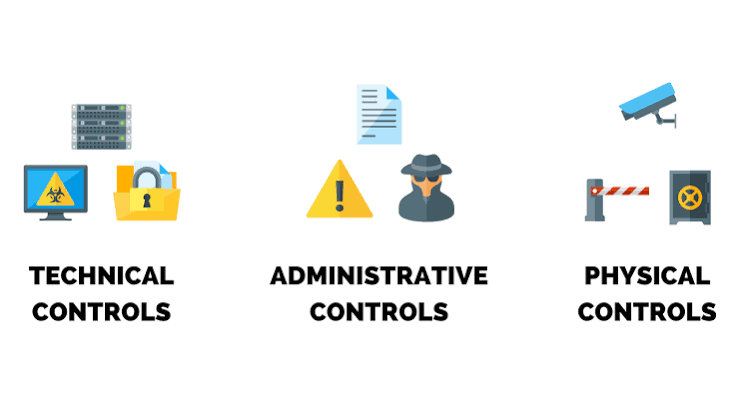

# Security Controls

 These are my personal notes and understanding of Security Controls while learning Cybersecurity.

 The explanations below are written in my own words to help me understand and remember the concepts more easily. I will continue updating these notes as I gain more knowledge and practical experience.

---

# What are Security Controls

Security controls are safeguards or protective measures implemented to protect an organization's systems, networks, applications, people, and data from security threats and cyber attacks.

The primary purpose of security controls is to

 Reduce security risks
 Prevent unauthorized access
 Detect security incidents
 Minimize the impact of attacks
 Protect the Confidentiality, Integrity, and Availability (CIA) of information
 Help organizations recover after a security incident

Security controls are generally divided into three major categories, and they are also classified into different types based on the purpose they serve.

---

# Categories of Security Controls

There are three main categories of security controls

1. Administrative  Managerial Controls
2. Physical Controls
3. Technical  Logical Controls

---

# 1. Administrative  Managerial Controls

Administrative (or Managerial) controls are rules, policies, procedures, standards, and guidelines created by an organization's management or administrators to guide how people should behave securely in the workplace.

These controls are mainly designed to reduce human error, improve security awareness, and ensure employees follow security best practices.

Unlike technical controls, administrative controls focus more on people and processes rather than technology.

### Examples

 Security awareness training
 Security policies
 Password policies
 Acceptable Use Policy (AUP)
 Incident Response Plan
 Risk assessments
 Employee onboarding
 Employee offboarding
 Background verification
 Security audits
 Compliance requirements

### Key Points

 Focuses on people and organizational processes
 Helps reduce insider threats
 Minimizes mistakes caused by human error
 Establishes security responsibilities for employees

---

# 2. Physical Controls

Physical controls are security measures that protect an organization's physical assets from unauthorized access, theft, vandalism, or environmental damage.

These are controls that we can physically see, touch, or interact with in the real world.

Their main objective is to prevent unauthorized individuals from gaining physical access to sensitive areas or equipment.

### Examples

 Biometric authentication
 Fingerprint scanners
 Facial recognition systems
 Key locks
 Smart card access
 Security guards
 CCTV cameras
 Security gates
 Fences
 Turnstiles
 Motion detectors
 Security lighting
 Server room locks

### Key Points

 Protects buildings, equipment, and employees
 Prevents physical theft and unauthorized access
 Often works together with administrative and technical controls

---

# 3. Technical  Logical Controls

Technical (or Logical) controls are digital security mechanisms that use hardware, software, firmware, and security technologies to protect systems, networks, and data.

These controls automatically enforce security rules and help defend against cyber attacks.

Unlike administrative controls, technical controls rely on technology instead of human behavior.

### Examples

 Firewalls
 Intrusion Detection Systems (IDS)
 Intrusion Prevention Systems (IPS)
 Antivirus software
 Endpoint Detection & Response (EDR)
 Multi-Factor Authentication (MFA)
 Encryption
 Access Control Lists (ACLs)
 Virtual Private Networks (VPNs)
 Network segmentation
 Data Loss Prevention (DLP)
 Web Application Firewalls (WAF)

### Key Points

 Protects digital assets
 Controls user access
 Detects malicious activity
 Prevents unauthorized access
 Secures data during storage and transmission

---

# Types of Security Controls

Apart from their categories, security controls are also classified according to the purpose they serve during a security incident.

---

# Preventive Controls

Preventive controls are designed to prevent security incidents or attacks before they happen.

Their main objective is to reduce the chances of a successful attack.

### Examples

 Firewalls
 Multi-Factor Authentication (MFA)
 Password policies
 Security awareness training
 Access control
 Network segmentation
 Antivirus software

### Purpose

Prevent attacks before they occur.

---

# Detective Controls

Detective controls are designed to detect security incidents while they are occurring or after they have occurred.

These controls help security teams investigate incidents and respond quickly.

### Examples

 Intrusion Detection Systems (IDS)
 Security Information and Event Management (SIEM)
 Audit logs
 CCTV cameras
 File Integrity Monitoring (FIM)
 Continuous security monitoring

### Purpose

Detect attacks and suspicious activities.

---

# Corrective Controls

Corrective controls are designed to repair the damage caused by a security incident and restore affected systems to a secure state.

These controls are implemented after an attack has occurred.

### Examples

 Installing security patches
 Removing malware
 Rebuilding compromised systems
 Resetting compromised passwords
 Updating firewall rules
 Fixing software vulnerabilities

### Purpose

Fix the damage caused by security incidents.

---

# Deterrent Controls

Deterrent controls are designed to discourage attackers from attempting malicious activities.

Although they may not physically stop an attacker, they reduce the likelihood of an attack by making the environment appear more secure.

### Examples

 CCTV cameras
 Security guards
 Warning banners
 Security signs
 Account lockout policies
 Visible fences

### Purpose

Discourage attackers before they attempt an attack.

---

# Recovery Controls

Recovery controls are special safeguards designed to recover damaged systems, restore lost data, and resume normal business operations after a security incident or disaster.

These controls focus on business continuity and disaster recovery.

### Examples

 Data backups
 Cloud backups
 Disaster Recovery Plans (DRP)
 Business Continuity Plans (BCP)
 Database restoration
 System restoration
 Redundant servers

### Purpose

Recover systems and data after an incident.

---

# Compensating Controls

Compensating controls are alternative security controls that provide a similar level of protection when the primary or recommended control cannot be implemented.

These controls help reduce risk until the original control becomes practical or available.

### Example Scenario

Suppose an old legacy application does not support Multi-Factor Authentication (MFA).

Since MFA cannot be implemented, the organization may compensate by

 Restricting access through a VPN
 Allowing access only from specific IP addresses
 Increasing security monitoring
 Using network segmentation

These become compensating controls because they provide alternative protection.

### More Examples

 Additional monitoring for legacy systems
 Manual approval processes
 Network isolation
 Extra logging and auditing

### Purpose

Provide an alternative security measure when the original control cannot be implemented.

---

# Quick Summary

## Categories of Security Controls

 Category                     Focus                            Examples                                                       
 ---------------------------  -------------------------------  -------------------------------------------------------------- 
 Administrative  Managerial  People, policies, and processes  Security policies, awareness training, onboarding, offboarding 
 Physical                     Physical assets and facilities   Biometric scanners, CCTV, fences, locks, security guards       
 Technical  Logical          Systems, networks, and data      Firewalls, IDS, IPS, MFA, VPN, encryption                      

---

## Types of Security Controls

 Type          Purpose                                    Examples                                         
 ------------  -----------------------------------------  ------------------------------------------------ 
 Preventive    Prevent attacks before they occur          Firewalls, MFA, Antivirus                        
 Detective     Detect attacks during or after they occur  IDS, SIEM, Audit Logs                            
 Corrective    Repair damage after an attack              Patching, Malware removal                        
 Deterrent     Discourage attackers                       CCTV, Security guards, Warning banners           
 Recovery      Recover systems and data                   Backups, Disaster Recovery, Business Continuity  
 Compensating  Alternative security controls              VPN, Network segmentation, Additional monitoring 

---

# Final Notes

 Security controls are often used together, not individually.
 A single control can sometimes fit into multiple categories or types, depending on how it is implemented.
 A strong security posture uses a combination of Administrative, Physical, and Technical controls to provide defense in depth.
 Understanding why a security control exists is just as important as memorizing its definition.

---

 Learning Note These notes reflect my current understanding of Security Controls while studying Cybersecurity. As I gain more hands-on experience and continue learning, I will update and improve them accordingly.
