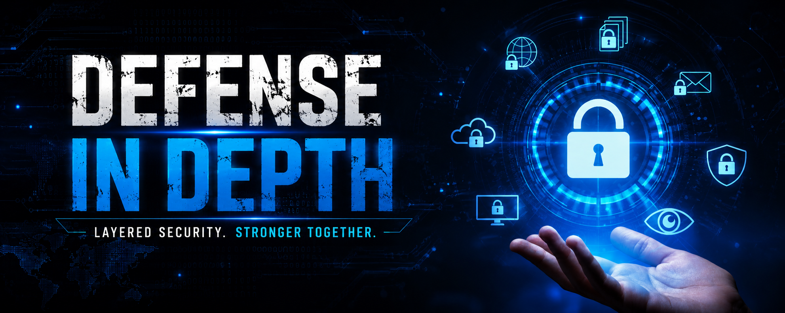

# DEFENSE IN DEPTH

Defense in Depth is a cybersecurity strategy where multiple security layers are implemented to protect assets, data, or systems.

We cannot rely on a single layer of security. The idea is that if one implemented security layer fails, another layer should be available to protect, detect, or contain the attack.

## Example

A bank has multiple layers of security controls such as:

* Fences / gates
* Security guards
* Doors and physical locks
* Vault
* Alarm systems

Let's say a threat actor plans to enter and rob the bank.

* He will face the fences and gates first, and let's say he somehow bypasses them. The first security control, which was the fences and gates, has now failed.
* Now the attacker will face another layer, which is the security guards. Let's say he also bypasses the guards.
* Now he will face the doors, and let's say he also bypasses the doors and locks.
* Now he will face the vault.

Let's say he somehow bypasses all of these layers, but bypassing all those layers will take a lot of time.

Likewise, in the digital world, an attacker will take a lot of time to bypass the implemented security layers.

So, the idea is to slow down the threat actor or attacker.

Now you may ask: **what is the use of all these layers if he successfully bypasses all of them and takes the money he wants?**

The answer is that during the process of bypassing these layers, the attacker will make noise and leave tracks behind, which can alert the bank officials so they can start prevention, detection, and response activities.

If he is bypassing all the layers such as gates, guards, and doors, he may make a mistake or trigger an alarm, which will alert the officers and they can take action.

That is the idea behind Defense in Depth and how the strategy becomes useful.

## Key Idea

**Defense in Depth is not about making attacks impossible.**

It is about:

* Slowing down the attacker.
* Increasing the attacker's effort and cost.
* Generating alerts and evidence.
* Giving defenders enough time to detect, respond to, and contain the attack.

# Typical Layers of Defense

## 1. Physical Security

Protects the actual hardware and facilities.

### Examples:

* Security guards
* CCTV cameras
* Biometric access systems
* Locked server rooms

---

## 2. Perimeter Security

Protects the network edge from external threats.

### Examples:

* Firewalls
* Web Application Firewalls (WAF)
* DDoS protection
* Email gateways

---

## 3. Network Security

Protects internal network traffic.

### Examples:

* Network segmentation
* VLANs
* Intrusion Detection Systems (IDS)
* Intrusion Prevention Systems (IPS)

---

## 4. Endpoint Security

Protects devices such as laptops and servers.

### Examples:

* Antivirus and EDR solutions
* Disk encryption
* Patch management
* Application control

---

## 5. Application Security

Protects software and web applications.

### Examples:

* Secure coding practices
* Input validation
* Authentication and authorization controls
* Security testing

---

## 6. Data Security

Protects sensitive information.

### Examples:

* Encryption
* Backups
* Data Loss Prevention (DLP)
* Access controls

---

## 7. Identity and Access Management (IAM)

Ensures users only access what they need.

### Examples:

* Multi-Factor Authentication (MFA)
* Role-Based Access Control (RBAC)
* Privileged Access Management (PAM)

---

## 8. Monitoring and Incident Response

Detects and responds to attacks.

### Examples:

* SIEM platforms
* Log monitoring
* Threat hunting
* Incident response plans

---

## 9. Security Awareness

Humans are often the target of attacks.

### Examples:

* Phishing training
* Security policies
* Awareness campaigns

