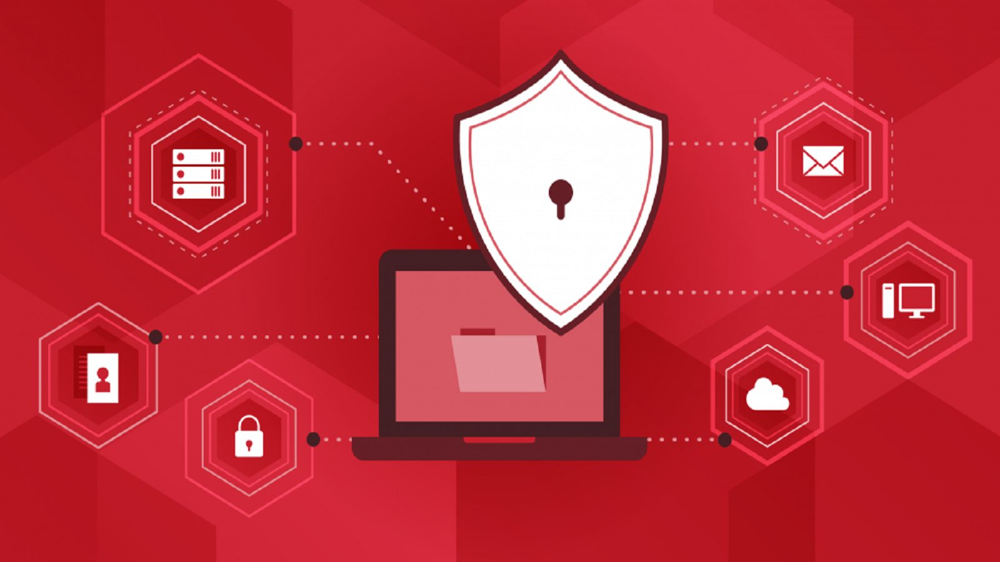

# Security Concepts 🔐
<p align="center">
  
</p>

## About

This repository documents my cybersecurity learning journey as I build a strong foundation in information security, offensive security, penetration testing, and security engineering.

The notes contained in this repository are based on my personal understanding of the concepts I study. Rather than copying textbook definitions, I aim to learn concepts, understand how they work, and document them in my own words.

The purpose of this repository is to:

* Build strong cybersecurity fundamentals
* Track my learning progress publicly
* Create a personal knowledge base for future reference
* Simplify complex security concepts using my own explanations
* Connect theoretical concepts with real-world security scenarios

---

## Learning Approach

For each topic, I try to:

* Understand the underlying theory
* Write notes in my own words
* Break down complex concepts into simple explanations
* Study real-world examples and attack scenarios
* Understand the practical security implications
* Connect concepts to penetration testing and offensive security
* Continuously improve and update my notes

This repository reflects my learning process, so some notes may evolve over time as my understanding improves.

---

## Why Security Fundamentals Matter

Strong security fundamentals are essential for understanding how attacks work, how defenses are implemented, and how organizations manage risk.

A solid understanding of security concepts helps in areas such as:

* Penetration Testing
* Red Teaming
* Vulnerability Assessment
* Security Engineering
* Threat Hunting
* Incident Response
* Malware Analysis
* Cloud Security
* Web Application Security

Many advanced cybersecurity topics become significantly easier to understand when the underlying security principles are clear.

---

## Repository Structure

Each topic is organized into its own folder containing notes, explanations, examples, diagrams, and learning resources.

```text
Security-Concepts/
│
├── 01-CIA-Triad/
├── 02-Asset-Threat-Vulnerability-Risk/
├── 03-Security-Controls/
├── 04-Defense-in-Depth/
├── 05-Least-Privilege/
├── 06-Authentication-vs-Authorization/
├── 07-Attack-Surface/
│
├── 08-Symmetric-vs-Asymmetric-Encryption/
├── 09-Hashing/
├── 10-Salting-and-Password-Storage/
├── 11-PKI-and-Certificates/
├── 12-TLS-SSL-Handshake/
│
├── 13-Common-Attack-Types/
├── 14-Malware-Types/
├── 15-Social-Engineering/
├── 16-Insider-Threats/
│
├── 17-CVSS/
├── 18-CVE-and-NVD/
├── 19-Incident-Response/
├── 20-MITRE-ATTACK/
├── 21-Cyber-Kill-Chain/
├── 22-NIST-CSF/
├── 23-OWASP/
│
└── README.md
```

---

## Topics Covered

### Core Concepts

* [x] CIA Triad
* [X] Asset, Threat, Vulnerability, Risk
* [X] Security Controls
* [ ] Defense in Depth
* [ ] Least Privilege
* [ ] Authentication vs Authorization
* [ ] Attack Surface

### Encryption & Hashing

* [ ] Symmetric vs Asymmetric Encryption
* [ ] Hashing (MD5, SHA1, SHA256)
* [ ] Salting & Password Storage
* [ ] PKI, Certificates & Certificate Chains
* [ ] TLS/SSL Handshake

### Threat Landscape

* [ ] Common Attack Types (Phishing, MITM, DoS, Brute Force)
* [ ] Malware Types (RAT, Trojan, Ransomware, Worm)
* [ ] Social Engineering Techniques
* [ ] Insider Threat Concepts

### Standards & Scoring

* [ ] CVSS Scoring
* [ ] CVE & NVD
* [ ] Incident Response (PICERL)
* [ ] MITRE ATT&CK Framework
* [ ] Cyber Kill Chain
* [ ] NIST Cybersecurity Framework
* [ ] OWASP Overview

---

## Goal

My goal is to build a strong understanding of security fundamentals that supports my journey toward becoming a cybersecurity professional, with a focus on penetration testing, offensive security, and practical security assessments.

---

## Progress

This repository is actively maintained and updated as I continue learning and documenting security concepts.

Every completed topic represents another step toward mastering the security fundamentals required in cybersecurity.

🚀 Learning one concept at a time.
